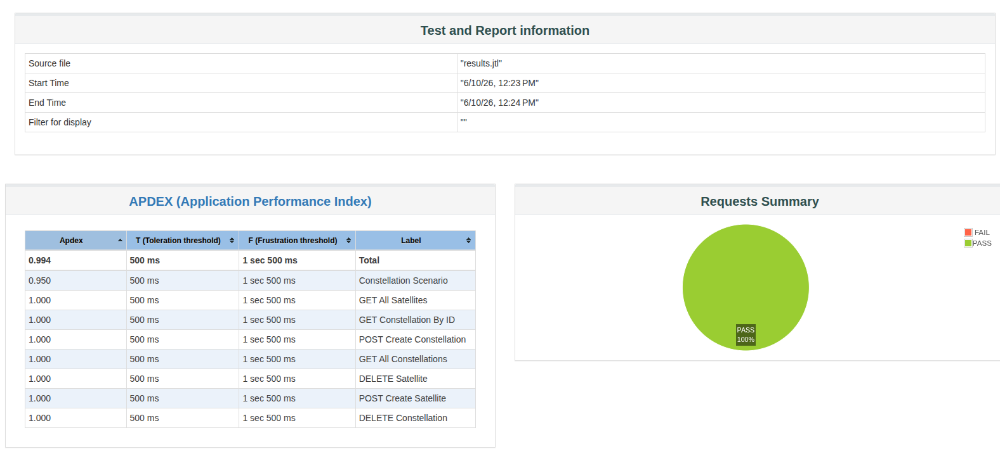
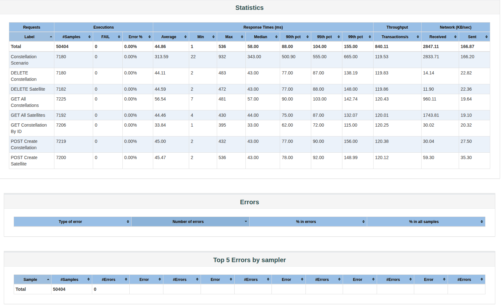

# Тестирование
Возможно некоторое количество ошибок из-за того-что могут иногда пересекаться id спутников и группировок при создании.
Количество пользователей - 50
Время разгона - 30с
Общее время тестирования - 60с

## Запуск сервера
- docker compose up --build -d

## Запуск тестов
- jmeter -n -t satellite_load_test.jmx -l results.jtl -e -o jmeter-report

## Отчёт
После выполнения всех команд html страница с отчётом будет расположена в: jmeter-report/index.html

